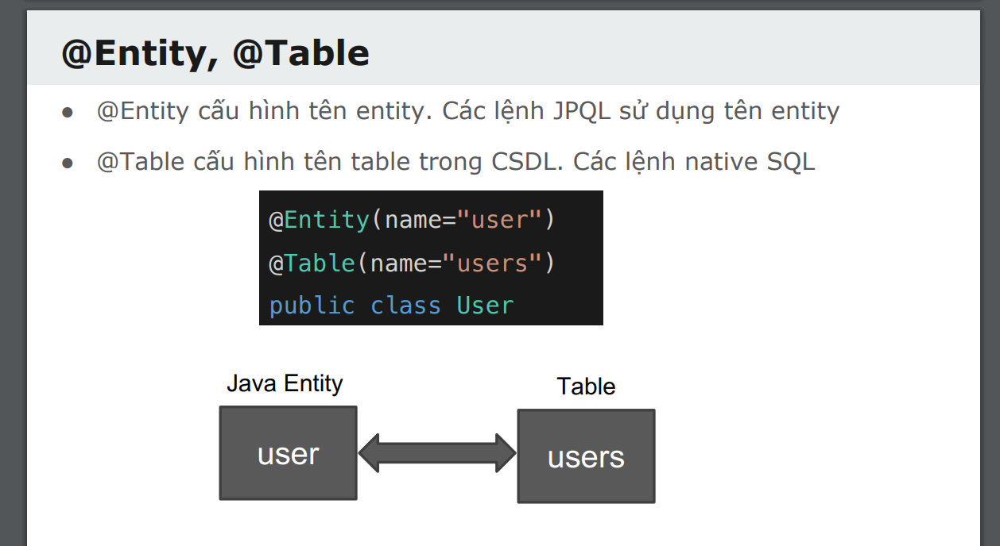
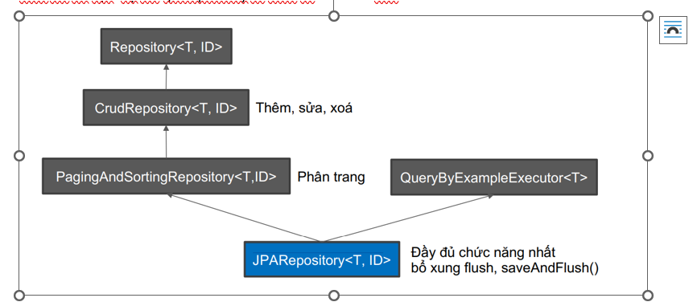
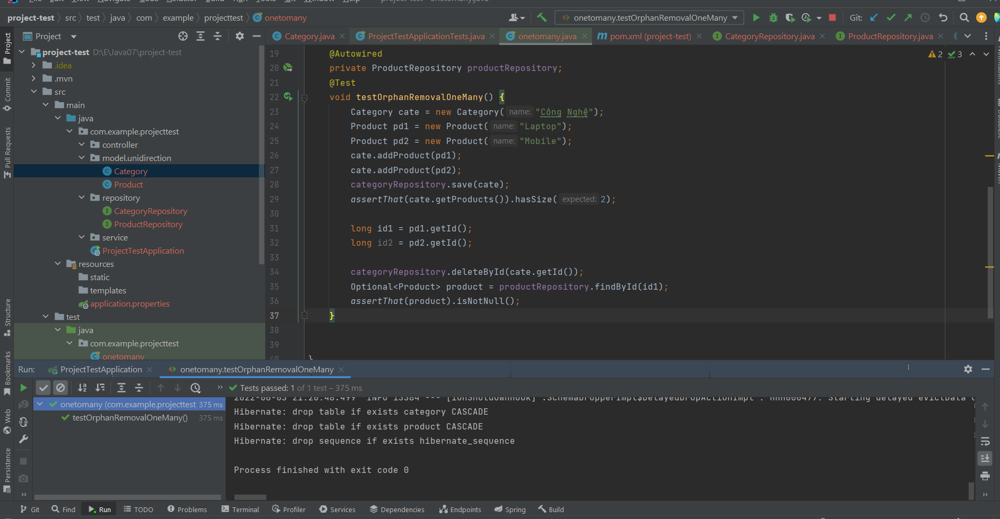

## Câu 1 : Thuộc tính name trong annotation @Entity khác với thuộc tính name trong @Table như thế nào? Hãy giải thích rõ cần thì minh hoạ

-Thuộc tính name trong name trong @Entity cấu hình tên Entity. Các câu lệnh JPQL sử dụng trên tên Entity

-Thuộc tính name trong @Table cấu hình tên bảng CSDL.Các câu lệnh native SQL



## Câu 2 : Để debug câu lệnh SQL mà Hibernate sẽ sinh ra trong quá trình thực thi, cần phải bổ sung lệnh nào vào file application.properties?

spring.jpa.show-sql=true

spring.jpa.properties.hibernate.format_sql=true

## Câu 3.Khi sử dụng H2, làm thế nào để xem được cơ sở dữ liệu và viết câu truy vấn?

Vào locohost:8080/h2-console và đăng nhập để xem cơ sở dữ liệu và viết query

## Câu 4. Khi viết mô tả một model, những thuộc tính chúng ta không muốn lưu xuống CSDL thì cần đánh dấu bằng annotation nào?
@Transient
## Câu 5. Annotation @Column dùng để bổ sung tính chất cho cột ứng với một thuộc tính. Tham số nào trong @Column sẽ đổi lại tên cột nếu muốn khác với tên thuộc tính, tham số nào chỉ định yêu cầu duy nhất, không được trùng lặp dữ liệu, tham số nào buộc trường không được null?

@Column bổ sung thuộc tính khi ánh xạ trường vào cột trong bảng

Tham số name trong @Column sẽ đổi lại tên cột nếu muốn khác tên thuộc tính 

Tham số unique trong @Column sẽ chỉ định yêu cầu là duy nhất, không được trùng lặp dữ liệu

Tham số nullable trong @Column cho phép null hay không null
## Câu 6. Có 2 sự kiện mà JPA có thể bắt được, viết logic bổ sung 
o Ngay trước khi đối tượng Entity lưu xuống CSDL (ngay trước lệnh INSERT)

o Ngay trước khi đối tượng Entity cập nhật xuống CSDL (ngay trước lệnh UPDATE)
Vậy 2 annotation này là gì

Trước khi lưu một entity mới – @PrePersist

Trước khi cập nhật một entity – @PreUpdate

## Câu 7. Tổ hợp các trường thông tin địa chỉ: country, city, county, addressline thường luôn đi cùng nhau và sử dụng lại trong các Entity khác nhau. Nhóm 2 annotation nào dùng để tái sử dụng,nhúng một Entity vào một Entity khác?

Nhóm 2 annotation dùng để tái sử dụng , nhúng 1 Entity vào 1 Entity khác là @Embeded và @Embededdable

## Câu 8. JpaRepository là một interface có sẵn trong thư viện JPA, nó cũng cấp các mẫu hàm thuận tiện cho thao tác dữ liệu. Cụ thể JpaRepository kế thừa từ interface nào?



## Câu 9. Hãy viết khai báo một interface repository thao tác với một Entity tên là Post, kiểu dữ liệu trường Identity là long, tuân thủ interface JpaRepository.

```java
public interface PostRepository extends JpaRepository<Post, Long> {
}
```
## Câu 10. Khi đã chọn một cột là Identity dùng @Id để đánh dấu, thì có cần phải dùng xác định unique dùng annotation @Column(unique=true) không?

Không vì @Id đã đánh dấu là khóa chính chỉ tồn duy nhất

## Câu 11. Khác biệt giữa @Id với @NaturalId là gì?
@NaturalID tạo unique constrain lên một trường không phải PrimaryKey

● Dùng cho những dữ liệu bản chất đã là unique mà không cần hệ thống sinh ví dụ như email, di
động, mã căn cước, ISBN

● @Id, primary cần giữ nguyên không đổi, nhưng @NaturalId có thể được phép thay đổi, miễn
đảm bảo duy nhất

## Câu 12. Có những cột không phải primary key (@Id) hay @NaturalId, dữ liệu có thể trùng lặp (unique không đảm bảo true), nhưng cần đánh chỉ mục (index) để tìm kiếm nhanh hơn vậy phải dùng annotation gì? Hãy viết 1 ví dụ sử dụng annotation đó với index cho 1 column và 1 ví dụ với index cho tổ hợp nhiều column. Tham khảo tại (https://www.baeldung.com/jpaindexes)

Cần đánh chỉ mục (index) để tìm kiếm nhanh hơn vậy phải dùng annotation @Index

Đánh dấu index cho 1 column

```java
@Table(indexes = @Index(columnList = "firstName"))
```

Đánh dấu index cho nhiều tổ hợp column
```java
@Index(name = "mulitIndex1", columnList = "firstName, lastName")

@Index(name = "mulitIndex2", columnList = "lastName, firstName")
```

## Câu 13. Annotation @GeneratedValue dùng để chọn cách tự sinh unique id cho primary key phải là trường kiểu int hoặc long. Nếu trường primary key có kiểu là String, chúng ta không thể dùng @GeneratedValue vậy hãy thử liệt kê các cách đảm bảo sinh ra chuỗi có tính duy nhất?

```java
@Id 
@Column(name = "id", nullable = false) 
private UUID id = UUID.randomUUID(); 
```

## Câu 14. Giả sử có 1 class Employee với các fields sau {id, emailAddress, firstName, lastName}. Hãy viết các method trong interface EmployeeRespository để :
o Tìm tất cả các Employee theo emailAddress và lastName

```java
 List<Employer> findEmployerByEmailAddressAndLastName();
```

o Tìm tất cả các Employee khác nhau theo firstName hoặc lastName
```java
  List<Employer> findEmployerByFirstNameOrLastName();
```

o Tìm tất cả các Employee theo lastName và sắp xếp thứ tự theo firstName tăng dần
```java
 List<Employer> findEmployerByLastNameAndOrderByFirstNameAsc();
```

o Tìm tất cả các Employee theo fistName không phân biệt hoa thường
```java
 List<Employer> findEmployerByFirstNameIgnoreCase();
```


## Câu 15. Hãy nêu cách sử dụng của @NamedQuery và @Query. Cho ví dụ

Annotation @Query để định nghĩa JPQL trong repository

Annotation @NameQuery được sử dụng để xác định một truy vấn được đặt tên. Việc đặt tên query giúp chúng dễ sử dụng lại câu truy vấn . Thực tế giá trị @NamedQuery mang lại không nhiều. Do đó hãy ưu tiên khai báo query trong Repository


## Câu 16 Làm thế nào để có thể viết custom method implemetations cho Jpa Repository. Nêu ví dụ
Chúng ta viết method interface vào  interface MyRepository implement Jpa Repository rồi implement chúng trong 1 bean
```java
@Repository
public interface MyEntityRepository extends JpaRepository<MyEntity, Long> {

    // EXAMPLE SPRING DATA METHOD
    List<MyEntity> findByCommentEndsWith(String x);

    List<MyEntity> doSomeHql(Long id);   // custom method, code at *Impl class below

    List<MyEntity> useTheRepo(Long id);  // custom method, code at *Impl class below

}
```
Custom methods implementation bean:

```java
@Component // Must be @Component !!
public class MyEntityRepositoryImpl { // must have the exact repo name + Impl !!

    @PersistenceContext
    private EntityManager entityManager;

    @Autowired
    private MyEntityRepository myEntityRepository;

    @SuppressWarnings("unused")
    public List<MyEntity> doSomeHql(Long id) {
        String hql = "SELECT eFROM MyEntity e WHERE e.id = :id";
        TypedQuery<MyEntity> query = entityManager.createQuery(hql, MyEntity.class);
        query.setParameter("id", id);
        return query.getResultList();
    }

    @SuppressWarnings("unused")
    public List<MyEntity> useTheRepo(Long id) {
        List<MyEntity> es = doSomeHql(id);
        es.addAll(myEntityRepository.findByCommentEndsWith("DO"));
        es.add(myEntityRepository.findById(2L).get());
        return es;
    }

}
```

## Câu 17. Hãy nêu 1 ví dụ sử dụng sorting và paging khi query đối tượng Employee ở trên
```java
@Repository
public interface EmployerRepository extends PagingAndSortingRepository<Employer, Integer> {
    Page<Employer> getAll(Pageable pageable);
}
```
Ở Service

```java
  @Override
    public Page<Employer> listEmployer(int pageNumber, String sortField, String sortDir) {
        Sort sort = Sort.by(sortField);
        sort = sortDir.equals("asc")?sort.ascending():sort.descending();
        Pageable pageable = PageRequest.of(pageNumber-1,10,sort);
        return employerRepository.getAll(pageable);
    }
```


## Câu 18

Product

```java
package com.example.projecttest.model.unidirection;

import com.fasterxml.jackson.annotation.JsonIgnore;
import lombok.AllArgsConstructor;
import lombok.Data;
import lombok.NoArgsConstructor;

import javax.persistence.*;

@Entity(name="product")
@Table(name="product")
@NoArgsConstructor
@AllArgsConstructor
@Data
public class Product {
  @Id
  @GeneratedValue(strategy = GenerationType.AUTO)
  private long id;
  private String name;

  public Product(String name) {
    this.name = name;
  }

  @ManyToOne(fetch = FetchType.LAZY)
  @JsonIgnore
  private Category category;

}


```


Category 

```java
package com.example.projecttest.model.unidirection;

import lombok.AllArgsConstructor;
import lombok.Data;
import lombok.NoArgsConstructor;

import javax.persistence.*;
import java.util.ArrayList;
import java.util.List;

@Entity(name="category")
@Table(name="category")
@NoArgsConstructor
@AllArgsConstructor
@Data
public class Category {
  @Id
  @GeneratedValue(strategy = GenerationType.AUTO)
  private long id;
  private String name;

  public Category(String name) {
    this.name = name;
  }

  @OneToMany(cascade = CascadeType.PERSIST, orphanRemoval = flase)
  @JoinColumn(name = "category_id")
  private List<Product> products = new ArrayList<>();

  public void addProduct(Product product) {
    product.setCategory(this);
    products.add(product);
  }

  public void removeProduct(Product product) {
    product.setCategory(null);
    products.remove(product);
  }

}


```

Test



Many to Many
Product
```java
package com.example.projecttest.model.unidirection;

import com.fasterxml.jackson.annotation.JsonIgnore;
import lombok.AllArgsConstructor;
import lombok.Data;
import lombok.NoArgsConstructor;

import javax.persistence.*;
import java.util.List;

@Entity(name="product")
@Table(name="product")
@NoArgsConstructor
@AllArgsConstructor
@Data
public class Product {
  @Id
  @GeneratedValue(strategy = GenerationType.AUTO)
  private long id;
  private String name;

  public Product(String name) {
    this.name = name;
  }

  @ManyToOne(fetch = FetchType.LAZY)
  @JsonIgnore
  private Category category;

  @ManyToMany
  @JoinTable(name = "product_tag" ,joinColumns = {@JoinColumn(name = "product_id")}, inverseJoinColumns = {@JoinColumn(name = "tag_id")})
  private List<Tag> tags;

}
```

Tag

```java
import lombok.AllArgsConstructor;
import lombok.Data;
import lombok.NoArgsConstructor;

import javax.persistence.*;
import java.util.List;

@Entity(name="tag")
@Table(name="tag")
@NoArgsConstructor
@AllArgsConstructor
@Data
public class Tag {
    @Id
    @GeneratedValue(strategy = GenerationType.AUTO)
    private long id;
    private String name;

    @ManyToMany(mappedBy = "tags")
    private List<Product> products;
}
```


